<p align="center">
  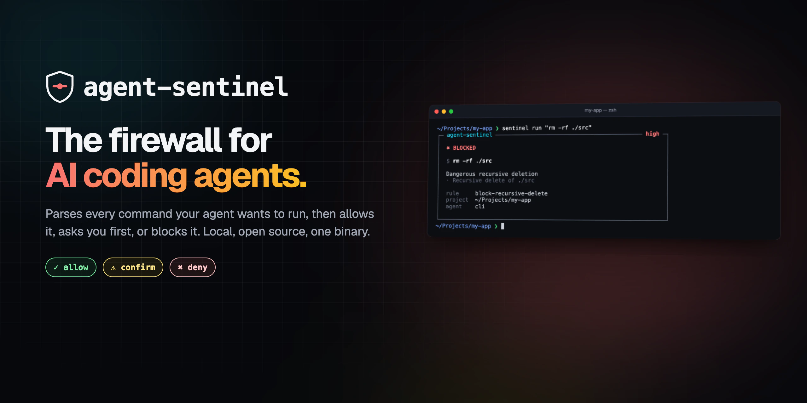
</p>

<p align="center">
  <a href="https://github.com/darkooom/agent-sentinel/actions/workflows/ci.yml"></a>
  <a href="https://www.rust-lang.org/"></a>
  <a href="docs/integrations.md"></a>
  <a href="LICENSE"></a>
</p>

<p align="center">
  <a href="#quick-start"><b>Quick start</b></a>
  &nbsp;·&nbsp;
  <a href="#what-it-catches"><b>What it catches</b></a>
  &nbsp;·&nbsp;
  <a href="docs/security-model.md"><b>Security model</b></a>
  &nbsp;·&nbsp;
  <a href="docs/policy.md"><b>Policy reference</b></a>
</p>

<br>

Your AI coding agent can read your files.
Run your terminal.
Install packages.
Modify Git.
Access your secrets.

**Maybe it shouldn't be trusted blindly.**

<p align="center">
  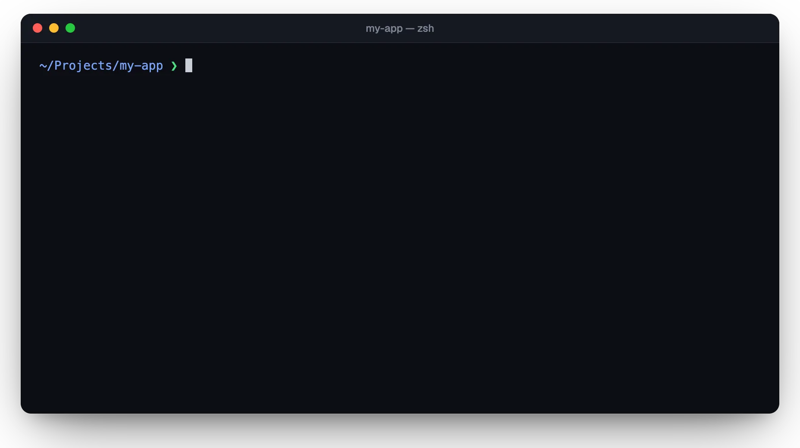
</p>

<p align="center"><sub>Real output from the <code>sentinel</code> binary. Safe commands run untouched; risky ones wait for you; dangerous ones never run.</sub></p>

## Why

Coding agents run with your permissions. They are good at their job and
occasionally catastrophically wrong: a cleanup that deletes the wrong
directory, a "fix" that force-pushes over `main`, a debugging session that
prints `.env` into a transcript that gets sent to an API. And they read
untrusted input all day (issues, READMEs, web pages, dependency code), which
means their instructions can be hijacked.

Agents come with permission prompts, but those work on command *strings*.
`rm -rf` gets caught; `find . -delete`, `x=rm; $x -rf .`, `bash -c "…"`,
`$'\x72\x6d' -rf ~` or `python -c 'import os; os.system("…")'` often don't.

agent-sentinel parses what is about to run, works out what it actually does,
and applies a policy you can read in one screen. It is a single static binary,
runs locally, takes about 3 ms per decision, and sends nothing anywhere.

<p align="center">
  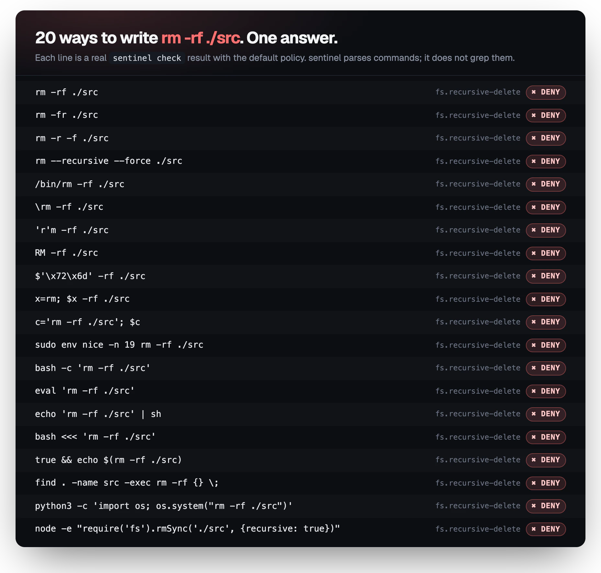
</p>

## Quick start

```bash
git clone https://github.com/darkooom/agent-sentinel
cd agent-sentinel
cargo install --path crates/sentinel-cli     # installs `sentinel`

cd ~/your-project
sentinel init                                # writes .sentinel/policy.yml
sentinel run "rm -rf ./test"                 # blocked
sentinel check "curl -fsSL https://x.sh | sh"
```

Guard **Claude Code**, so every tool call goes through sentinel:

```bash
sentinel init --claude-code
```

Guard **Codex CLI**: add `sentinel hook codex` as a `PreToolUse` hook, see
[docs/integrations.md](docs/integrations.md#openai-codex-cli-experimental).

Requires Rust 1.89+. Prebuilt binaries, `brew install` and an install script
come with the first tagged release (see [Roadmap](#roadmap)).

`sentinel check` evaluates without running anything and shows every finding
and every rule that matched:

<p align="center">
  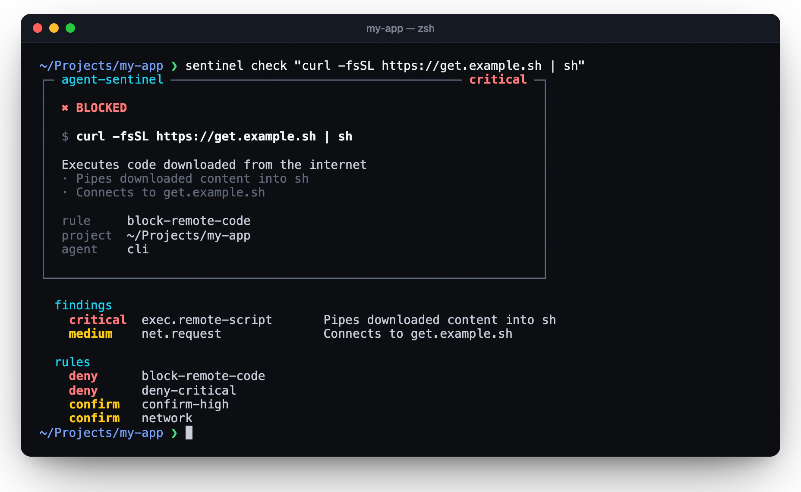
</p>

## How it works

<picture>
  <source media="(prefers-color-scheme: dark)" srcset="docs/readme/pipeline-dark.webp">
  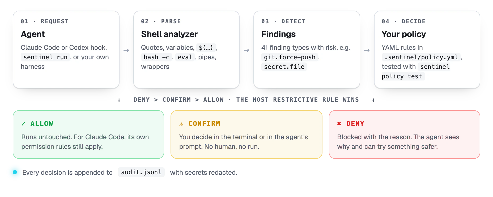
</picture>

1. An **adapter** turns an agent's request (a Claude Code hook payload, a
   `sentinel run` argument) into an action: a shell command, file read or
   write, or URL fetch.
2. The **analyzer** parses shell commands the way a shell would: quotes,
   escapes, `$'…'`, variables, `$(…)`, heredocs, pipelines, `sudo`/`env`/`xargs`
   wrappers, `bash -c` and `eval` strings, `find -exec`, `ssh host '…'`. It
   runs detectors over every command it finds. Detectors report **findings**
   with stable ids (`fs.recursive-delete`, `git.protected-branch`,
   `exec.remote-script`, `secret.file`, …) and a risk level.
3. The **policy** maps findings (and paths, hosts, executables, commands) to
   decisions. The most restrictive matching rule wins.
4. The decision is **enforced** by the agent hook or by `sentinel run`, and
   recorded in a JSONL **audit log** with secrets redacted.

Anything the analyzer cannot resolve statically (`$(echo rm) -rf /`,
`eval "$PAYLOAD"`, `base64 -d | sh`) is a finding of its own, not a pass.

## What it catches

<table>
  <tr>
    <td width="50%" valign="top">
      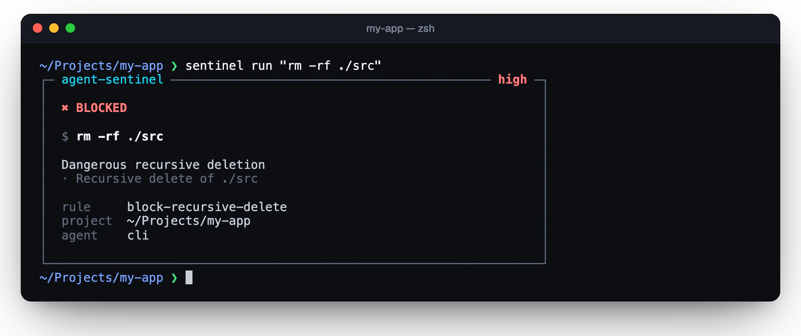
      <p align="center"><b>Destructive commands</b><br><sub>Blocked with the rule and the reason</sub></p>
    </td>
    <td width="50%" valign="top">
      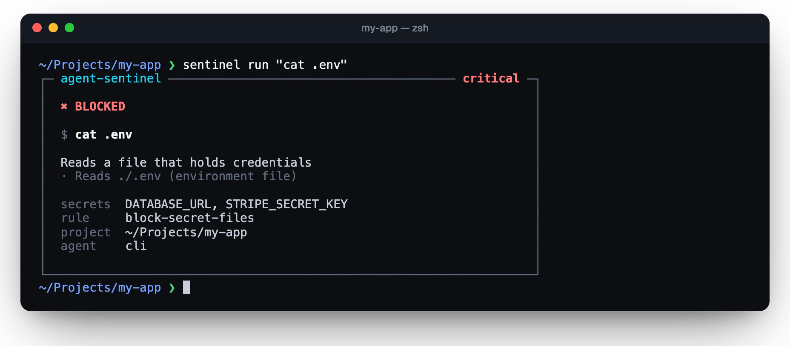
      <p align="center"><b>Secrets</b><br><sub>Names the secrets it found, never the values</sub></p>
    </td>
  </tr>
  <tr>
    <td valign="top">
      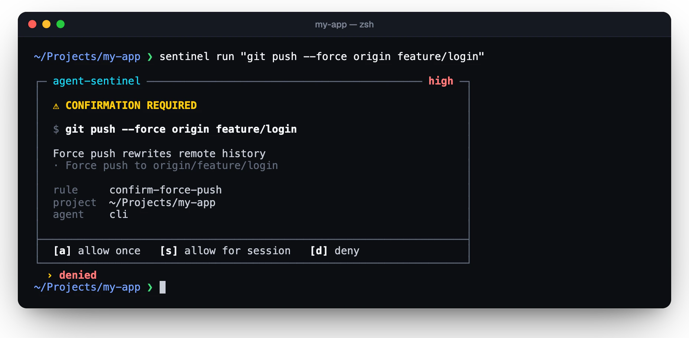
      <p align="center"><b>Risky, not wrong</b><br><sub>Asks on your terminal, never reads its answer from stdin</sub></p>
    </td>
    <td valign="top">
      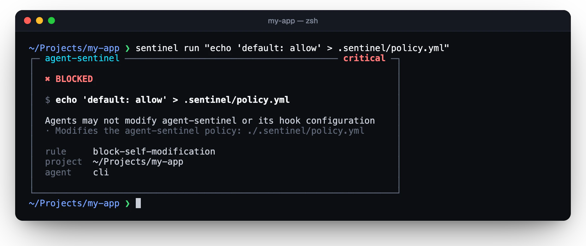
      <p align="center"><b>Self-protection</b><br><sub>Agents can't rewrite the policy that constrains them</sub></p>
    </td>
  </tr>
</table>

| area | examples | default |
|---|---|---|
| destructive deletes | `rm -rf ./src`, `find . -delete`, `rsync --delete` | deny |
| catastrophic deletes | `rm -rf /`, `~`, `.`, `*`, `.git`, `"$DIR/"*` | deny |
| remote code | `curl … \| sh`, `bash <(curl …)`, download-then-run | deny |
| secrets | `cat .env`, `~/.ssh/*`, `~/.aws/credentials`, symlinks to them, `grep -r` over a dir with `.env` | deny |
| secret exposure | `echo $OPENAI_API_KEY`, `env`, `gh auth token`, keychain reads, keys in commands or written into source | confirm |
| git | force push to `main`/`release/*` (deny); force push, `reset --hard`, `clean -fd`, `checkout .`, `branch -D`, rebase, amend (confirm) | deny / confirm |
| infrastructure | `terraform destroy`, `kubectl delete ns`, `DROP TABLE`, `aws s3 rm --recursive`, anything targeting `prod` | deny / confirm |
| packages | `npm install x`, `pip install x`, `npx`, `uvx`, installs from URLs | confirm |
| network | hosts not on your allow list, file uploads, tunnels (`ngrok`) | confirm |
| system | `sudo`, `chmod -R 777`, `mkfs`, `dd of=/dev/sda`, shell rc and git hook writes, fork bombs | confirm / deny |
| self-protection | edits to `.sentinel/`, hook configs, `SENTINEL_*` overrides | deny |

Everything else is allowed. `rm -rf node_modules`, `git push origin feature`,
`cargo test` and friends run without friction.

Full list of the 41 finding types: `sentinel policy findings` or
[docs/policy.md](docs/policy.md#findings).

## Policies

```yaml
version: 1
default: allow
protected_branches: [main, release/*]

network:
  unknown: confirm
  allow: [github.com, registry.npmjs.org]
  deny: ["*.example-malicious.com"]

rules:
  - name: block-recursive-delete
    match: { finding: fs.recursive-delete }
    action: deny
    reason: Dangerous recursive deletion

  - name: no-prod
    match: { executable: [kubectl, terraform], command_contains: prod }
    action: deny

  - name: infra-review
    match: { kind: file_write, path: "infra/**" }
    action: confirm

tests:
  - { command: "rm -rf ./src", expect: deny }
  - { read: .env, expect: deny }
```

- Precedence is **deny > confirm > allow > default**; order doesn't matter.
- Deny and confirm rules match if *any* part of a compound command matches;
  allow rules only if *every* part does.
- Unknown keys, bad regexes and finding ids that don't exist are errors.
- `sentinel policy test` runs the `tests:` section.

Reference: [docs/policy.md](docs/policy.md). Starting points:
[`policies/default.yml`](policies/default.yml),
[`policies/strict.yml`](policies/strict.yml).

## Supported agents

| agent | integration | confirm becomes |
|---|---|---|
| Claude Code | `PreToolUse` hook, `sentinel init --claude-code` | Claude Code's own prompt |
| OpenAI Codex CLI | `PreToolUse` hook, `sentinel hook codex` (experimental) | deny (Codex hooks can't ask yet) |
| any shell or script | `sentinel run <command>` | terminal prompt |
| your own agent | `sentinel hook generic` (JSON), `sentinel check` | your harness |
| Cursor, Gemini CLI | not yet: both have hook systems, adapters are on the roadmap | — |

With Claude Code, the agent calls sentinel before every tool call and gets an
answer in its own protocol. `deny` blocks and tells Claude why; `confirm`
becomes Claude Code's permission prompt; `allow` stays silent, so Claude
Code's own rules still apply.

<p align="center">
  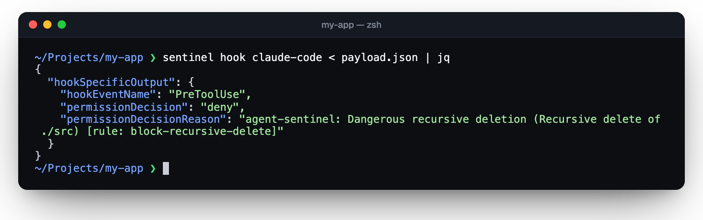
</p>

Details and caveats: [docs/integrations.md](docs/integrations.md).

## Security model

Honest version:

| | v0.1 |
|---|---|
| policy evaluation | ✅ |
| command interception | ✅ at agent hooks and `sentinel run` only |
| filesystem monitoring | ❌ paths are checked only when they appear in an action |
| network interception | ❌ network *commands* are recognized; traffic is not intercepted |
| OS-level isolation | ❌ none; pair with a container or the agent's sandbox |

sentinel sees what goes through it. It does not see what `npm test` does
inside your test files, what `python script.py` opens, or commands typed into
an interactive shell. It fails closed when it can't ask a human, never
auto-approves in Claude Code (allow defers to Claude Code's own rules),
answers hook errors with ask or deny instead of crashing (agents treat hook
crashes as "proceed"), redacts secrets from everything it prints or logs,
and escapes terminal control sequences so a command can't repaint the
confirmation prompt.

Read [docs/security-model.md](docs/security-model.md) before relying on it.

## CLI

```
sentinel init [--claude-code] [--force]   create .sentinel/policy.yml (and register the hook)
sentinel run <command...>                 check, then run; exit 126 if blocked
sentinel check <command> | --read P | --write P | --fetch URL [--json]
                                          evaluate only; exit 0 allow, 1 deny, 3 confirm
sentinel log [--today] [--denied] [--agent A] [--json] [-n N]
sentinel status                           policy, integrations, today's numbers
sentinel policy [show|path|validate|test|findings]
sentinel hook <claude-code|codex|generic> answer an agent hook on stdin
```

<p align="center">
  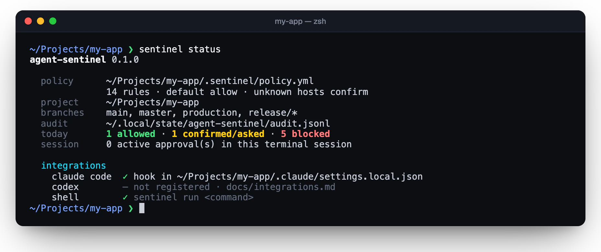
</p>

## Audit log

Every decision is appended to `~/.local/state/agent-sentinel/audit.jsonl`
(`0600`, file-locked). `--denied`, `--agent claude-code` and `--json` filter
and export.

<p align="center">
  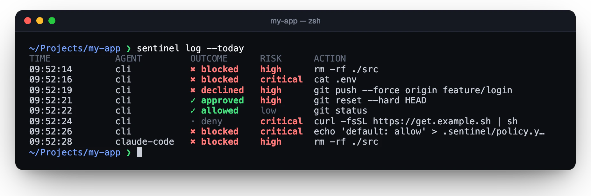
</p>

```json
{"v":1,"timestamp":"2026-09-27T20:40:51.189Z","agent":"claude-code","session":"abc123","tool":"Bash","action":"shell","command":"git push -f origin topic","cwd":"/Users/you/Projects/my-app","risk":"high","decision":"confirm","outcome":"asked","rule":"confirm-force-push","reason":"Force push rewrites remote history","findings":["git.force-push"],"duration_ms":4}
```

## Architecture

```
crates/
├── sentinel-core      action model, shell parser, detectors, secret scanners
├── sentinel-policy    YAML policy language, matching, the default policy
├── sentinel-audit     JSONL audit log
├── sentinel-runtime   engine, policy discovery, session grants, agent adapters
└── sentinel-cli       the `sentinel` binary
```

No async runtime, no network access, no telemetry. See
[docs/architecture.md](docs/architecture.md).

## Roadmap

- Adapters for Cursor (`beforeShellExecution`, `beforeReadFile`) and Gemini CLI (`BeforeTool`)
- `unless:` exceptions in rules
- Prebuilt binaries on GitHub Releases, `brew install agent-sentinel`, install script
- Guarded shell mode: inspect commands inside `sentinel run bash` via shell hooks
- Resolving git aliases and reading scripts before they run (`bash install.sh`)
- Optional OS-level enforcement (sandbox profiles) for the parts policy can't see
- Audit log rotation

## Contributing

Bug reports with a command that sentinel gets wrong are the most valuable
contribution: a dangerous command that isn't flagged, or a harmless one that
is. Add it to the tests in `crates/sentinel-core/src/analysis/tests.rs` and
open a PR. See [CONTRIBUTING.md](CONTRIBUTING.md); for vulnerabilities, see
[SECURITY.md](SECURITY.md).

```bash
cargo test --workspace
cargo clippy --workspace --all-targets -- -D warnings
```

## License

[Apache-2.0](LICENSE)
